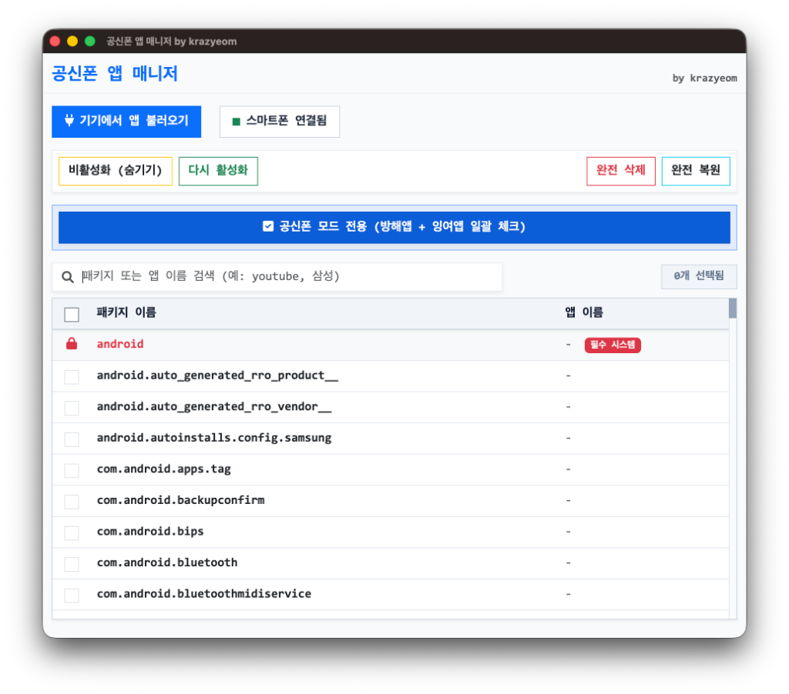

# 공신폰 앱 매니저 2.0 (Kongsin App Manager)

**Made by krazyeom**

스마트폰 하드웨어나 루팅 없이, 안드로이드 스마트폰에 기본 설치된 앱(통신사 앱, 제조사 앱 등)을 정리 할 수 있는 강력한 데스크탑 유틸리티입니다. v2.0부터 Electron 기반의 빠르고 모던한 UI로 재탄생했습니다.



## 🚀 주요 기능 (Features)
* **스마트 자동 연결**: 기기가 연결되면 즉시 상태를 인식하고 자동으로 설치된 패키지 목록을 가져옵니다.
* **앱 리스트 불러오기**: 내 폰에 설치된 모든 패키지 이름과 실제 앱 이름을 한눈에 확인합니다.
* **직관적인 검색**: `samsung`, `chrome` 등의 키워드 또는 패키지명으로 원하는 앱을 빠르게 검색합니다.
* **비활성화 (숨기기)**: 사용하지 않는 기본 시스템 앱을 즉시 비활성화하여 시스템 구동에서 숨깁니다.
* **활성화 & 복원**: 비활성화된 앱을 다시 원상복구 하거나 완전 삭제된 시스템 앱을 복원시킵니다.
* **완전 삭제 (Uninstall)**: 시스템 내부에서 기본 앱을 강제 완전 삭제하여 시스템 용량을 비웁니다.
* 🎓 **공신폰 모드 전용 (올인원 선택)**: 클릭 한 번으로 학생들에게 방해가 되는 스토어, SNS, 엔터테인먼트, 잉여 앱 등을 일괄 찾아 체크해줍니다.
* 🛡️ **핵심 시스템 앱 보호**: 폰을 `벽돌`로 만들 수 있는 안드로이드 핵심 시스템 앱(전화, 설정, 시스템UI 등)은 실수로라도 삭제하지 못하도록 **자동으로 잠금 처리**되어 시스템을 안전하게 보호합니다.

## 💻 실행 방법 (How to use)

### 1. 릴리즈 버전 다운로드 (일반 사용자)
우측의 **[Releases]** 탭에서 운영체제에 맞는 최신 버전을 다운로드하세요.

* **Mac**: `Kongsin App Manager-2.0.0-arm64-mac.zip` 압축을 풀고 안의 앱을 실행합니다.
* **Windows**: `Kongsin App Manager Setup 2.0.0.exe` 인스톨러를 다운받아 설치합니다.

### 📱 스마트폰 준비사항 (필수)
1. 휴대폰 설정 > 휴대전화 정보 > 소프트웨어 정보에서 `빌드 번호`를 7번 연타하여 **개발자 옵션**을 활성화시킵니다.
2. 설정 > 개발자 옵션으로 들어가서 **`USB 디버깅`**을 켭니다.
3. USB 케이블로 휴대폰을 PC에 연결합니다.
4. 본 프로그램을 켜고 `기기에서 앱 불러오기` 버튼을 누릅니다. **(이때 폰 화면에서 반드시 [디버깅 허용]을 눌러야 합니다!)**

## 🛠 개발 및 빌드 (For Developers)

이 프로젝트는 **Node.js**와 **Electron**을 기반으로 만들어졌습니다.

```bash
# 의존성 설치
npm install

# 개발 모드로 실행 (수정 사항 즉시 확인 가능)
npm start

# Windows용 앱 빌드 (x64)
npm run build:win

# Mac용 앱 빌드 (Mac 기기에서 실행)
npm run build:mac
```
